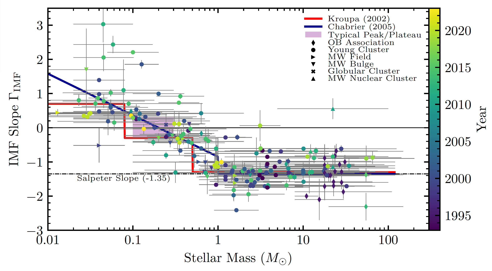

# alphaplot
A living data compilation of IMF slope measurements, replicating and extending the "Alpha-plot" of Scalo 1998 Kroupa 2002. The data are in alphaplot.csv which is editable in any spreedsheet editor (e.g. Excel, Sheets, Calc). The plot appears in the [Hennebelle & Grudic 2024](https://arxiv.org/abs/2404.07301v1) ARAA review, which is the preferred citation *for the compilation work*. Please remember to cite respective authors for their individual data.

This comes with no guarantee of completeness - apologies if your data have been left out. This is intended to be a *living* compilation supported by the community.

This also comes with no guarantee of *homogeneity* - we are simply reporting the inferred IMF slopes reported by different authors in a given mass interval.

If you open the [PDF version](https://data.obs.carnegiescience.edu/starforge/IMF_AlphaPlot.pdf) you can click on the datapoints and it will take you to the ADS page!

# Contributing to this compilation

We strongly encourage the community to assist in maintaining this compilation. If you would like to add an IMF measurement, please 

1. Branch this repository.
2. Edit the spreadsheet alphaplot.csv with your new data, filling in as many fields as are available.
3. Commit and push changes to your branch and issue a pull request to this repository, and I will review and implement the changes.
